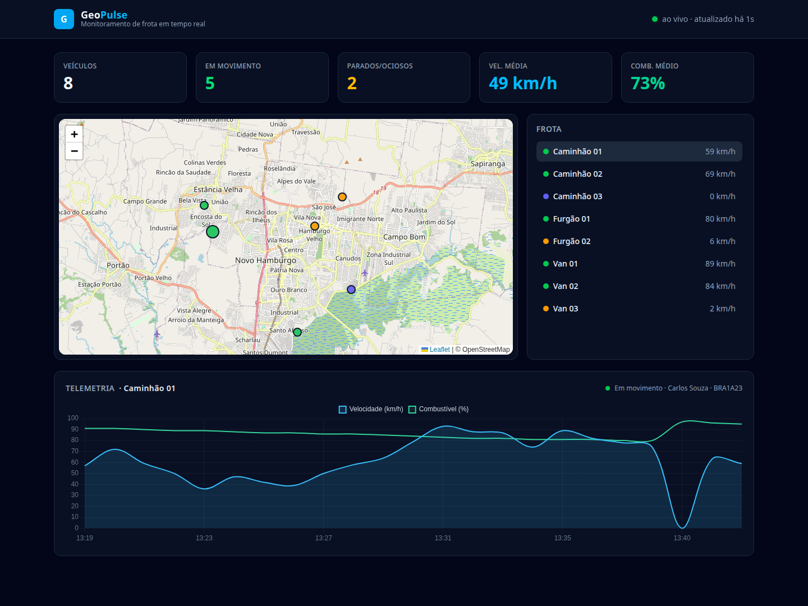

# GeoPulse

> Painel de **monitoramento de frota em tempo real** — mapa ao vivo, indicadores e telemetria, com uma **API REST** (Laravel) consumida por uma **SPA em Vue 3**.

[](https://github.com/ReneMartins1983/GeoPulse/actions/workflows/ci.yml)
[](https://geopulse-crsn.onrender.com)


🌐 **Demo ao vivo:** **<https://geopulse-crsn.onrender.com>**

> Roda no plano gratuito do Render: o primeiro acesso após inatividade pode levar ~30–50s para "acordar".

O GeoPulse simula uma frota de veículos que se movimenta em tempo real. O back-end
expõe uma **API REST** com a posição e a telemetria dos veículos; o front-end é uma
**Single Page Application em Vue 3** que mostra um **mapa interativo (Leaflet)**,
**indicadores (KPIs)** e **gráficos de telemetria (Chart.js)**, atualizando sozinha.

## 📸 Tela



## ✨ Funcionalidades

- 🗺️ **Mapa ao vivo** (Leaflet) com a frota, marcadores coloridos por status.
- 📊 **Indicadores (KPIs)**: total, em movimento, parados, velocidade e combustível médios.
- 📈 **Telemetria por veículo** (gráfico de velocidade e combustível ao longo do tempo).
- ⏱️ **Tempo real** via polling — a SPA busca a API a cada 5s.
- 🔌 **API REST** (Laravel + API Resources), pronta para consumo externo.
- 🧪 Testada (feature tests da API) e com **CI**.

## 🛠️ Stack

| Camada    | Tecnologia                                  |
| --------- | ------------------------------------------- |
| Back-end  | Laravel 12 · PHP 8.3 · API REST (Sanctum)   |
| Front-end | **Vue 3** (SPA) · Vite · Tailwind CSS 4      |
| Mapas     | Leaflet + OpenStreetMap                      |
| Gráficos  | Chart.js                                     |
| Banco     | MySQL 8.4                                    |
| Ambiente  | Docker (PHP-FPM, Nginx, MySQL, Node 20)      |

## 🏗️ Arquitetura

- **API desacoplada** (`routes/api.php`) servindo `Vehicle`/`Reading` via **API Resources**.
- **Motor de simulação** (`App\Services\TelemetryService`): faz a frota andar (random walk),
  atualiza velocidade/combustível/status e grava leituras. É acionado de forma **throttled**
  a cada requisição da listagem (mantém a demo "viva" mesmo sem worker) e também via o
  comando `php artisan telemetry:tick` (agendável).
- **SPA Vue 3** consome a API e faz **polling** a cada 5s, atualizando mapa, KPIs e gráfico.

## ⚙️ Como funciona

### Fluxo dos dados

```
[Simulação] ──grava──> [MySQL] <──consulta── [API REST] ──JSON──> [SPA Vue]
   (tick)            vehicles/readings                          mapa + KPIs + gráfico
     ▲                                                                │
     └───────────────── a cada 5s a SPA chama a API ──────────────────┘
```

### Ciclo de atualização (a cada 5s)

1. A SPA chama `GET /api/stats` e `GET /api/vehicles`.
2. A API avança a simulação se necessário, consulta o banco e devolve JSON (via API Resources).
3. A SPA atualiza os marcadores do mapa e os KPIs; para o veículo selecionado, busca
   `GET /api/vehicles/{id}/readings` e redesenha o gráfico.

### Simulação da frota

O `TelemetryService` faz, a cada *tick*, para cada veículo: sorteia status/velocidade,
move a posição um passo na direção atual (*random walk* ao redor de Novo Hamburgo/RS,
voltando ao centro se afastar demais), consome combustível e grava uma leitura.

Para a demo ficar "viva" **sem um worker dedicado**, o tick é disparado pela própria API
de forma **throttled** (`tickIfStale`, no máximo a cada ~4s). Em produção real, o mesmo
passo roda via `php artisan telemetry:tick` agendado.

### Componentes da SPA (`resources/js/components/`)

| Componente | Responsabilidade |
| --- | --- |
| `Dashboard.vue` | Orquestra: busca a API, faz o polling e distribui os dados |
| `FleetMap.vue` | Mapa Leaflet — marcadores por status, clique seleciona o veículo |
| `SpeedChart.vue` | Gráfico Chart.js (velocidade + combustível) do veículo |
| `StatCard.vue` | Cartões de indicadores (KPIs) |

## 🚀 Como rodar

Pré-requisitos: **Docker** e **Docker Compose**.

```bash
cp .env.example .env

# imagem + dependências
UID=$(id -u) GID=$(id -g) docker compose build app
docker compose up -d
docker compose exec app composer install
docker compose exec app php artisan key:generate
docker compose exec app php artisan migrate --seed

# assets (Vue/Vite)
docker compose run --rm node npm install
docker compose run --rm node npm run build
```

Acesse **http://localhost:8002**.

## 🔌 API

| Método | Rota | Descrição |
| --- | --- | --- |
| `GET` | `/api/stats` | Indicadores agregados da frota |
| `GET` | `/api/vehicles` | Lista a frota com o estado atual |
| `GET` | `/api/vehicles/{id}/readings` | Série temporal recente do veículo |

## 🧪 Testes

```bash
docker compose exec app php artisan test
```

## 📄 Licença

MIT.
